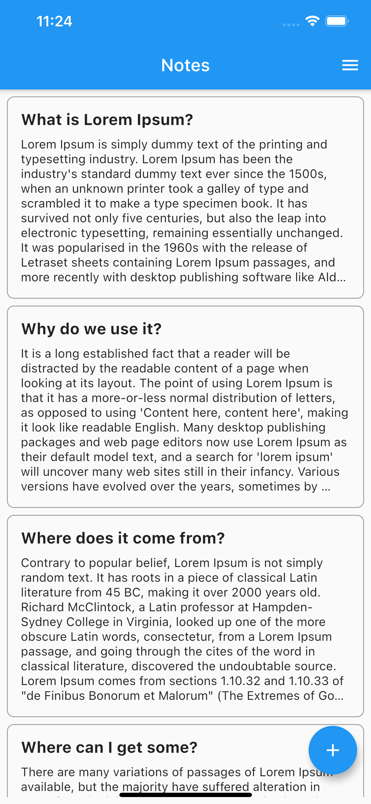
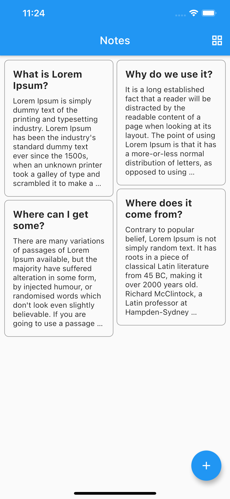
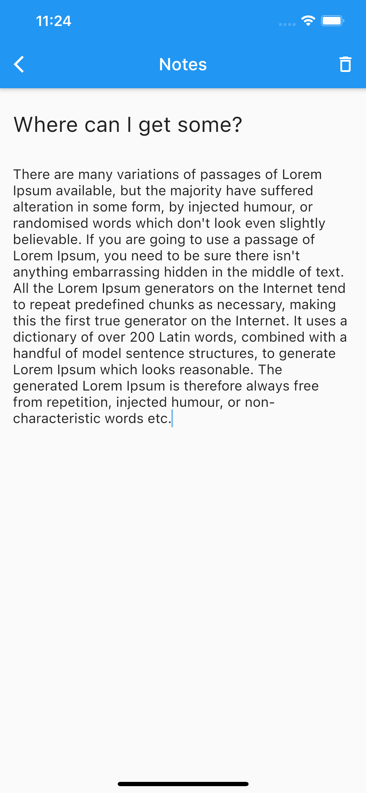

# Keep Notes

An implementation of `sembast` package to make keep notes app.


Notes in List View             |Notes in Grid View |  Add, Update, Delete Notes
:-------------------------:|:-------------------------:|:-------------------------:
  | | 


Hey guys! Today we are going to learn about **sembast** package in flutter.

Sembast db stands for **S**imple **Emb**edded **A**pplication **St**ore **d**ata**b**ase

        #sembast
        #“NoSQL persistent store database solution for single process io applications”

We will be building a simple `Keep Notes` app to perform simple CRUD operations to store data in local database on mobile. Just a small app only for demonstration. No high expectations please. Haha!

Lets begin!!!

## Step 1 :  Install Packages

Place the below dependencies in your `pubspec.yaml` file and run `flutter pub get`
```
  
  sembast: version_here
  
```

## Step 2 : Create Model Class

Create the model class we need to store and extract data from the databse as `note.dart`.

```dart
class Note {
  int id;
  String title;
  String description;

  Note({this.id, this.title, this.description});

  Map<String, dynamic> toMap() {
    return {
      'id': id,
      'title': title,
      'description': description,
    };
  }

  static Note fromMap(Map<String, dynamic> map) {
    return Note(
      id: map['id'],
      title: map['title'],
      description: map['description'],
    );
  }
}
```

## Step 3 : Opening the Database

We are going to create an AppDatabase class to hold all of the database opening logic. One more thing about a database being opened - it needs to happen only once. For that reason,  AppDatabase class will be a singleton - a class with only a single instance. Singleton is a design pattern which makes sure we can very simply access an instance of a class, while ensuring that there can be only one instance of a given type.

```dart
import 'dart:async';

import 'package:path/path.dart';
import 'package:path_provider/path_provider.dart';
import 'package:sembast/sembast.dart';
import 'package:sembast/sembast_io.dart';

class AppDatabase {
  static final AppDatabase _singleton = AppDatabase._();
  static AppDatabase get instance => _singleton;
  Completer<Database> _dbOpenCompleter;
  AppDatabase._();
  Future<Database> get database async {

    if (_dbOpenCompleter == null) {
      _dbOpenCompleter = Completer();
      _openDatabase();
    }
    return _dbOpenCompleter.future;
  }

  Future _openDatabase() async {
    final appDocumentDir = await getApplicationDocumentsDirectory();
    final dbPath = join(appDocumentDir.path, 'demo.db');

    final database = await databaseFactoryIo.openDatabase(dbPath);
    _dbOpenCompleter.complete(database);
  }
}
```

## Step 4 : Data Access Object

Now that we have the core low-level AppDatabase class which is a singleton used to get the single opened instance of a SEMBAST database and we also have a Note model class, we can finally write functions responsible for inserting, updating, deleting and getting data from the database. By convention, such classes are called Data Access Objects or shortly Dao.

```dart
import 'package:keep_notes/model/note.dart';
import 'package:sembast/sembast.dart';
import 'app_database.dart';

class NotesDao {
  static const String NOTE_STORE_NAME = 'Notes';
  final _notesStore = intMapStoreFactory.store(NOTE_STORE_NAME);
  Future<Database> get _db async => await AppDatabase.instance.database;

  Future createNote(Note note) async {
    await _notesStore.add(await _db, note.toMap());
  }

  Future<List<Note>> readAllNotes() async {
    final finder = Finder(sortOrders: [
      SortOrder('id'),
    ]);

    final recordSnapshots = await _notesStore.find(
      await _db,
      finder: finder,
    );
    return recordSnapshots.map((snapshot) {
      final note = Note.fromMap(snapshot.value);
      note.id = snapshot.key;
      return note;
    }).toList();
  }

  Future update(Note note) async {
    final finder = Finder(filter: Filter.byKey(note.id));
    await _notesStore.update(
      await _db,
      note.toMap(),
      finder: finder,
    );
  }

  Future delete(Note note) async {
    final finder = Finder(filter: Filter.byKey(note.id));
    await _notesStore.delete(
      await _db,
      finder: finder,
    );
  }

}
```

## Step 5 : State Management Using BLoC

Currently, we have the model layer finished - we can read and write to the SEMBAST NoSQL database. While we could call the NotesDao's functions directly from Widgets, doing so would tightly couple our UI with the SEMBAST DB.
While in this tutorial we are surely not going to move away from SEMBAST, in a real project it's more than expected that sooner or later you will perform some drastic changes to how your app is wired. You might want to store data on a remote server, for instance.
This is the reason for adding a middleman between the UI and the model layer. We are going to use arguably the best state management library out there and that is BLoC.

```dart
 import 'dart:async';
import 'package:keep_notes/databse/notes_dao.dart';
import 'package:keep_notes/model/note.dart';

class NotesBloc {
  NotesDao notesDao = NotesDao();

  StreamController notesStreamController =
      StreamController<List<Note>>.broadcast();

  StreamSink<List<Note>> get notesSink => notesStreamController.sink;

  Stream<List<Note>> get notesStream => notesStreamController.stream;

  readAllNotes() async {
    List<Note> notes = await notesDao.readAllNotes();
    notesSink.add(notes);

  }

  createNote(Note note) async {
    await notesDao.createNote(note);
    readAllNotes();
  }

  updateNote(Note note) async{
    await notesDao.update(note);
    readAllNotes();
  }

  deleteNote(Note note) async {
    await notesDao.delete(note);
    readAllNotes();
  }

  dispose() {
    notesStreamController.close();
  }
}

```

## Step 6 : Create the UI

For creating the home page UI we have used `ListView.separated` to render list and `StaggeredGridView` to view the items in a grid view.

```dart
import 'package:flutter/material.dart';
import 'package:flutter_staggered_grid_view/flutter_staggered_grid_view.dart';
import 'package:keep_notes/bloc/blocs.dart';
import 'package:keep_notes/databse/notes_dao.dart';
import 'package:keep_notes/model/note.dart';
import 'package:keep_notes/pages/add_note.dart';

class HomePage extends StatefulWidget {
  @override
  _HomePageState createState() => _HomePageState();
}

class _HomePageState extends State<HomePage> {
  NotesDao notesDao = NotesDao();
  GlobalKey _sgwKey = GlobalKey();

  /// true list false grid
  bool isList = true;

  @override
  void initState() {
    notesBloc.readAllNotes();
    super.initState();
  }

  @override
  Widget build(BuildContext context) {
    return Scaffold(
      appBar: AppBar(
        actions: [
          Padding(
            padding: EdgeInsets.only(right: 12),
            child: InkWell(
                onTap: () {
                  setState(() {
                    isList = !isList;
                  });
                },
                child: isList ? Icon(Icons.menu) : Icon(Icons.grid_view)),
          ),
        ],
        title: Text('Notes'),
      ),
      body: Padding(
        padding: const EdgeInsets.all(8.0),
        child: Column(
          crossAxisAlignment: CrossAxisAlignment.start,
          children: <Widget>[
            StreamBuilder(
              stream: notesBloc.notesStream,
              builder: (context, snapshot) {
                if (snapshot.hasData) {
                  return Expanded(
                    child: isList
                        ? ListView.separated(
                            separatorBuilder: (context, index) {
                              return SizedBox(
                                height: 8,
                              );
                            },
                            shrinkWrap: true,
                            itemCount: snapshot.data != null
                                ? snapshot.data.length
                                : 0,
                            itemBuilder: (BuildContext context, int index) {
                              return buildListItem(snapshot.data[index]);
                            },
                          )
                        : StaggeredGridView.count(
                            key: _sgwKey,
                            crossAxisSpacing: 6,
                            mainAxisSpacing: 6,
                            crossAxisCount:
                                _colForStaggeredView(context, snapshot.data),
                            children:
                                List.generate(snapshot.data.length, (index) {
                              return _tileGenerator(snapshot.data[index]);
                            }),
                            staggeredTiles: _tilesForView(snapshot.data),
                          ),
                  );
                } else {
                  return Expanded(
                      child: Center(
                    child: Text('No Data'),
                  ));
                }
              },
            ),
          ],
        ),
      ),
      floatingActionButton: FloatingActionButton(
        onPressed: goToNotes,
        child: Icon(Icons.add),
      ), // This trailing comma makes auto-formatting nicer for build methods.
    );
  }

  Widget buildListItem(Note note) {
    return InkWell(
      onTap: () {
        goToNotes(note: note);
      },
      child: Container(
        decoration: BoxDecoration(
          border: Border.all(color: Colors.grey, width: 1),
          borderRadius: BorderRadius.all(Radius.circular(8)),
        ),
        child: Padding(
          padding: const EdgeInsets.all(15),
          child: Column(
            crossAxisAlignment: CrossAxisAlignment.start,
            children: [
              Text(
                note.title,
                maxLines: 10,
                overflow: TextOverflow.ellipsis,
                style: TextStyle(
                  fontWeight: FontWeight.bold,
                  fontSize: 18,
                ),
              ),
              Visibility(
                visible: note.description.isNotEmpty,
                child: Padding(
                  padding: const EdgeInsets.only(top: 10),
                  child: new Text(
                    note.description,
                    maxLines: 10,
                    overflow: TextOverflow.ellipsis,
                  ),
                ),
              ),
            ],
          ),
        ),
      ),
    );
  }

  int _colForStaggeredView(BuildContext context, List<Note> notes) {
    return MediaQuery.of(context).size.width > 600 ? 3 : 2;
  }

  List<StaggeredTile> _tilesForView(List<Note> notes) {
    return List.generate(notes.length, (index) {
      return StaggeredTile.fit(1);
    });
  }

  Widget _tileGenerator(Note note) {
    return GestureDetector(
      child: buildListItem(note),
    );
  }

  void goToNotes({Note note}) {
    Navigator.push(
        context,
        MaterialPageRoute(
          builder: (context) => AddNote(note: note),
        ));
  }
}

```

That's it folks! We're done with all the coding. Just go ahead and run your app!

Fantastic!! You have just learned how to evaluate math expressions in flutter using `sembast`.

## Important:

This repository is only for providing information on `sembast`. Please do not misuse it.

## Author:

* [Amit Mishra](https://github.com/amitmishra7)

If you like this tutorial please don't forget to add a **Star**. Also follow to get informed for upcoming tutorials.